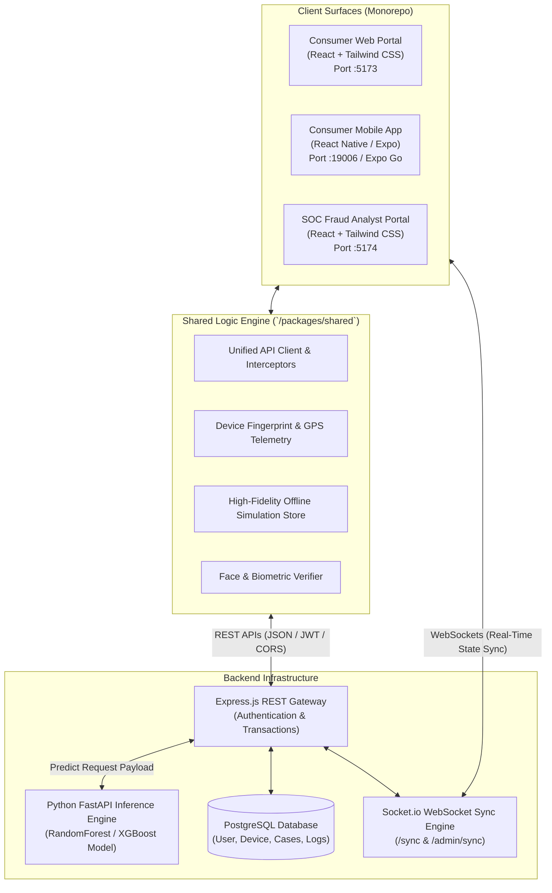
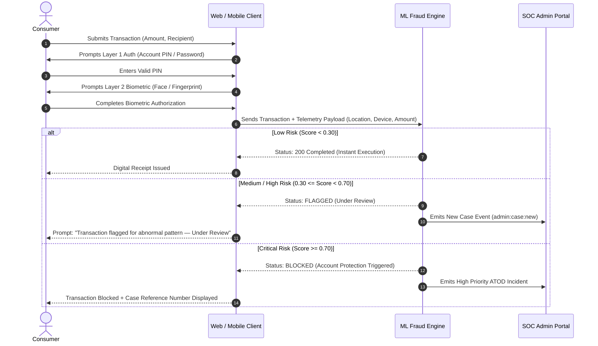

# AI-Based Detection of Suspicious Mobile Money Transactions Caused by Account Compromise and Abnormal Transaction Behaviour

[](#system-architecture)
[-61DAFB.svg)](#technology-stack)
[](#backend--machine-learning-integration)
[](#research--system-scope)

---

## Executive Summary & Research Abstract

Mobile Money (MoMo) systems in Sub-Saharan Africa and developing economies have revolutionized financial inclusion, yet they have simultaneously become prime targets for cybercrime, credential theft, and unauthorized access. Traditional static, rule-based fraud detection systems deployed by telecommunication operators often fail to capture dynamic behavioral anomalies and rapid account compromise.

This repository provides the reference implementation and experimental prototype for the research study:
> **"AI-Based Detection of Suspicious Mobile Money Transactions Caused by Account Compromise and Abnormal Transaction Behaviour"**

The project realizes an end-to-end, multi-surface financial platform comprising **three client surfaces** (Consumer Web Client, Consumer Mobile Application, and Fraud Analyst SOC Admin Portal), backed by a cloud-hosted Machine Learning inference pipeline and a real-time behavioral telemetry engine. The platform is designed to evaluate, test, and demonstrate real-time fraud mitigation across two primary vectors: **Account Takeover Detection (ATOD)** and **Transaction Anomaly Detection**.

---

## Table of Contents

1. [Research & System Scope](#research--system-scope)
   - [In-Scope Detection Vectors](#1-in-scope-detection-vectors)
   - [Explicitly Out-of-Scope Domains](#2-explicitly-out-of-scope-domains)
   - [Implementation-Layer Security Enhancements](#3-implementation-layer-security-enhancements)
2. [System Architecture](#system-architecture)
3. [Multi-Surface Platform Overview](#multi-surface-platform-overview)
   - [Web Client App (`apps/web`)](#1-consumer-web-client-appsweb)
   - [Mobile Client App (`apps/mobile`)](#2-consumer-mobile-client-appsmobile)
   - [Fraud Analyst Admin Portal (`apps/admin`)](#3-fraud-analyst-soc-admin-portal-appsadmin)
   - [Shared Core Package (`packages/shared`)](#4-shared-core-domain-packagesshared)
4. [Layered Authentication & Step-Up Escalation Protocol](#layered-authentication--step-up-escalation-protocol)
5. [Fraud Detection Methodology & Telemetry Signals](#fraud-detection-methodology--telemetry-signals)
   - [Account Takeover Detection (ATOD) Signals](#account-takeover-detection-atod-signals)
   - [Behavioral Anomaly Scoring](#behavioral-anomaly-scoring)
   - [Feature Vector Specification for ML Engine](#feature-vector-specification-for-ml-engine)
6. [Backend & Machine Learning Integration](#backend--machine-learning-integration)
7. [Technology Stack](#technology-stack)
8. [Directory Structure](#directory-structure)
9. [Installation & Deployment Guide](#installation--deployment-guide)
10. [Research Evaluation & Demonstration Scenarios](#research-evaluation--demonstration-scenarios)
11. [Citation & Project Attribution](#citation--project-attribution)

---

## Research & System Scope

The boundary of this research and software prototype has been established to ensure empirical validity, repeatable testing, and clear separation of concerns:

### 1. In-Scope Detection Vectors

The system evaluates and mitigates fraud through two specific vectors:

* **Vector 1: Account Takeover Detection (ATOD)**
  Detects when unauthorized entities gain control of a legitimate user's wallet credentials. Identified via four key telemetry anomalies:
  1. **Unregistered Device Identity**: Transaction initiated from an unrecognized device identifier or hardware signature differing from the user's primary enrolled device.
  2. **Unfamiliar Geolocation**: Transactions originating from geographical coordinates or regions outside the user's historical radius or typical velocity boundaries.
  3. **Unusual Transaction Velocity / Frequency**: Bursts of high-frequency balance inquiries or transactions following dormant periods or credential updates.
  4. **Simulated e-SIM Discrepancies**: Detection of device/carrier metadata shifts between authentication sessions.

* **Vector 2: Transaction Anomaly Detection**
  Detects transactions where the account credentials and device are legitimate, but the transaction attributes deviate radically from the user's personal behavioral baseline (e.g., historical expenditure ranges of GHS 50.00 – GHS 300.00 suddenly punctuated by a GHS 8,000.00 transfer attempt).

---

### 2. Explicitly Out-of-Scope Domains

To maintain rigorous scientific focus and avoid dependencies on inaccessible telecommunications infrastructure:

| Domain | Reason for Exclusion |
|---|---|
| **High-Risk Receiver Profiling** | Graph-based mule account clustering and destination network analysis are excluded from this phase. |
| **Physical SIM-Swap Fraud** | Real-world SIM swaps require proprietary mobile network operator (MNO) Signaling System 7 (SS7) / HLR data. The system utilizes a **simulated e-SIM profile** client-side to model hardware trust without claiming MNO-level SS7 detection. |
| **Social Engineering & Vishing** | Psychological manipulation of victims (e.g., caller ID spoofing, fraudulent agent calls) is not modeled through technical client telemetry. |
| **Money Laundering Syndicates** | Macro-economic AML graph clustering is outside group project scope. |
| **Merchant / Agent Collusion** | Rogue mobile money kiosk agent fraud is excluded. |

---

### 3. Implementation-Layer Security Enhancements

The system implements security UX mechanisms that interact directly with the fraud engine:
* **Dual-Layer Step-Up Escalation**: Layer 1 (MoMo PIN / Password) combined with Layer 2 (Biometric Fingerprint / Facial Recognition).
* **Dynamic Review States**: Transitions between `Completed`, `Flagged (Under Review)`, and `Blocked`.
* **Audited SOC Analyst Actions**: Case escalation, transaction approval/rejection, and emergency simulated account freezes.

---

## System Architecture

The project employs a distributed monorepo architecture connecting multiple client frontends with backend API services, WebSocket synchronization channels, and a cloud-based Machine Learning prediction engine.



---

## Multi-Surface Platform Overview

The platform provides dedicated, role-specific interfaces:

### 1. Consumer Web Client (`apps/web`)
* **Role**: Primary desktop/browser portal for everyday financial operations.
* **Key Modules**:
  * **Onboarding & Simulated KYC**: Multi-step identity verification (Ghana Card input formatted as `GHA-XXXXXXXXX-X`, facial capture, password enrollment).
  * **Wallet Services**: Peer-to-peer Send Money, Cash Out (Agent Code), Cash In (Deposit), Utility Bill Payment, and Merchant Goods Payment.
  * **Biometric Step-Up Engine**: In-browser camera-based facial landmark detection utilizing MediaPipe and canvas computer vision.
  * **Telemetry Capture**: In-browser GPS geolocation (fallback to IP-based approximate location) and client browser fingerprinting.

### 2. Consumer Mobile Client (`apps/mobile`)
* **Role**: Native/mobile financial companion mimicking real-world smartphones.
* **Key Modules**:
  * **Hardware Biometrics**: Direct integration with device biometric sensors (Fingerprint / TouchID / FaceID) via `expo-local-authentication`.
  * **Simulated e-SIM Telemetry**: Generation of simulated device fingerprints and carrier identifiers.
  * **Real-Time Cross-Surface Sync**: Socket.io listener providing instantaneous balance updates when transactions are executed across web or admin surfaces.

### 3. Fraud Analyst SOC Admin Portal (`apps/admin`)
* **Role**: Security Operations Center (SOC) dashboard for fraud analysts and investigators.
* **Key Modules**:
  * **Real-Time Flagged Feed**: Live triage queue categorizing incidents by detection vector (`ATOD` vs. `Transaction Anomaly`).
  * **Side-by-Side Behavioral Comparison**: Visual contrast between historical account baseline statistics ($avg$, $min$, $max$) and the flagged transaction parameters.
  * **Interactive Investigation Studio**: Telemetry inspector showing device IP, GPS coordinates on interactive maps, ML risk probability percentage, and decisioning triggers.
  * **Analyst Action Panel**: One-click case approval, transaction blocking, risk escalation, and account status freezing.

### 4. Shared Core Domain (`packages/shared`)
* Centralized business logic, type definitions, API clients, and mock data stores:
  * [`client.js`](file:///c:/Users/Atabisa%20Williams/Desktop/Simulated%20mobile%20money%20app%20(web%20+%20mobile%20client%20+%20admin%20portal)/packages/shared/src/api/client.js): Configurable Axios HTTP client with JWT interceptors.
  * [`endpoints.js`](file:///c:/Users/Atabisa%20Williams/Desktop/Simulated%20mobile%20money%20app%20(web%20+%20mobile%20client%20+%20admin%20portal)/packages/shared/src/api/endpoints.js): End-user transaction and authentication endpoints.
  * [`admin-endpoints.js`](file:///c:/Users/Atabisa%20Williams/Desktop/Simulated%20mobile%20money%20app%20(web%20+%20mobile%20client%20+%20admin%20portal)/packages/shared/src/api/admin-endpoints.js): SOC analyst API endpoints.
  * [`store.js`](file:///c:/Users/Atabisa%20Williams/Desktop/Simulated%20mobile%20money%20app%20(web%20+%20mobile%20client%20+%20admin%20portal)/packages/shared/src/api/store.js): `SimStore` singleton managing local fallback storage, transaction histories, and balance ledgers.
  * [`face-detector.js`](file:///c:/Users/Atabisa%20Williams/Desktop/Simulated%20mobile%20money%20app%20(web%20+%20mobile%20client%20+%20admin%20portal)/packages/shared/src/utils/face-detector.js): Browser facial tracking engine.

---

## Layered Authentication & Step-Up Escalation Protocol

To reflect modern financial security standards without creating friction for benign transactions, the system implements a **Risk-Adaptive Multi-Factor Authentication (MFA)** workflow:



---

## Fraud Detection Methodology & Telemetry Signals

### Account Takeover Detection (ATOD) Signals

| Telemetry Signal | Source | Detection Logic | Research Rationale |
|---|---|---|---|
| **Device Identifier Discrepancy** | `deviceProfile.deviceId` | Compare incoming hash with registered hardware signature (`knownDevices[]`). | Unauthorized access typically occurs via an attacker's computer or secondary mobile device. |
| **Geographic Distance Anomaly** | `location: {lat, long}` | Haversine distance computation against historical login coordinates. | Attackers frequently operate in distinct regions or through remote proxy exit nodes. |
| **Temporal Discrepancy** | Timestamp (UTC) | Time-of-day histogram comparison against user activity patterns. | Account compromises frequently occur during victim sleep hours to delay discovery. |

### Behavioral Anomaly Scoring

For transactions on familiar devices, the model analyzes numerical deviations:
$$\text{Anomaly Ratio} = \frac{\text{Transaction Amount}}{\mu_{\text{historical}}}$$
* If $\text{Anomaly Ratio} \le 2.0$: Considered within acceptable bounds for routine transfers.
* If $2.0 < \text{Anomaly Ratio} \le 5.0$: Elevates risk score to `Medium` (triggers review status).
* If $\text{Anomaly Ratio} > 5.0$ and historical count $> 5$: Flags transaction as high-risk anomaly.

### Feature Vector Specification for ML Engine

The backend evaluates a structured 18-feature inference payload transmitted to the prediction microservice:

```json
{
  "is_new_user": 0,
  "txn_unusual_location": 1,
  "txn_unusual_time": 0,
  "txn_unusual_amount": 1,
  "device_changed": 1,
  "ip_mismatch": 1,
  "has_multiple_anomalies": 1,
  "sim_device_change": 1,
  "account_takeover_risk": 0.85,
  "fraud_detected": 1,
  "was_reversed": 0,
  "was_reported": 0,
  "fraud_account_takeover": 1,
  "platform_mtn_momo": 1,
  "txn_cash_in": 0,
  "txn_cash_out": 0,
  "victim_vulnerability": 0.2,
  "detection_score": 0.89
}
```

---

## Backend & Machine Learning Integration

The production deployment consists of two interconnected cloud services hosted on Render:

1. **Express.js API Gateway** (`https://machine-learning-server-3.onrender.com`):
   * Provides user registration (`POST /`), authentication (`POST /login`), user state query (`GET /user`), and transaction orchestration (`POST /transaction`).
   * Issues session-scoped HTTP-only JWT cookies:
     ```http
     Set-Cookie: jwt=<token>; Path=/; HttpOnly; Secure; SameSite=Lax
     ```
   * Enforces Joi schema validation for phone formats, Ghana Card structure (`GHA-XXXXXXXXX-X`), and location coordinates.

2. **FastAPI Machine Learning Service**:
   * Evaluates feature payloads using trained predictive models (Random Forest / Gradient Boosted Trees).
   * Returns fraud probability score ($0.0 \dots 1.0$), associated risk categorization, and contributing anomaly signals.

---

## Technology Stack

| Layer | Component | Technologies |
|---|---|---|
| **Frontend Clients** | Web Client (`/apps/web`) | React 18, Vite, Tailwind CSS, Heroicons, Redux Toolkit |
| | Mobile Client (`/apps/mobile`) | React Native, Expo 51, Expo Local Authentication |
| | Admin SOC Portal (`/apps/admin`) | React 18, Vite, Tailwind CSS, Recharts |
| **Shared Core** | Shared Domain (`/packages/shared`) | ES Modules, Axios, MediaPipe Face Tracking |
| **Backend & Cloud** | Gateway & Auth | Node.js, Express.js, Joi Validator |
| | Predictive Engine | Python 3.10+, FastAPI, Scikit-Learn |
| | Database & Storage | PostgreSQL (Production) / LocalStorage SimStore (Offline) |
| | Real-Time Sync | Socket.io (WebSocket client/server) |

---

## Directory Structure

```text
.
├── apps/
│   ├── admin/                 # SOC Fraud Analyst Portal
│   │   ├── src/
│   │   │   ├── pages/         # LiveFeed, CaseDetail, Analytics
│   │   │   └── components/    # Analyst tools and triage cards
│   │   └── package.json
│   ├── mobile/                # Consumer Mobile Application
│   │   ├── src/
│   │   │   └── components/    # CashOutModal, PinPad, TransactionModal
│   │   ├── App.jsx            # Expo root component
│   │   └── package.json
│   └── web/                   # Consumer Web Application
│       ├── src/
│       │   ├── components/    # BiometricModal, PinPad, TransactionFlow
│       │   ├── contexts/      # AuthContext, Session & Telemetry State
│       │   ├── pages/         # Dashboard, SendMoney, Onboarding, CashOut
│       │   └── store/         # Redux Toolkit store & slices
│       ├── vite.config.js     # Dev server proxy configuration
│       └── package.json
├── packages/
│   └── shared/                # Core domain library
│       └── src/
│           ├── api/           # client.js, endpoints.js, admin-endpoints.js, store.js
│           ├── components/    # Cross-platform SVG Icons & UI badges
│           ├── constants/     # Risk thresholds, currency, route constants
│           └── utils/         # biometrics.js, face-detector.js, device.js, location.js
├── assets/                    # Project diagrams, branding, visual assets
├── flowchart.md               # Detailed Mermaid system flowcharts
├── package.json               # Root monorepo workspace configuration
├── pnpm-workspace.yaml        # PNPM workspace definition
└── server-readme              # Backend schema reference guide
```

---

## Installation & Deployment Guide

### Prerequisites
* **Node.js**: Version `18.x` or `20.x` LTS
* **PNPM**: Package manager (`npm install -g pnpm`)
* **Expo Go**: (Optional, for physical mobile testing) on Android/iOS

### 1. Repository Setup & Dependency Installation
```bash
# Clone the repository
git clone https://github.com/heyywillz/Simulated-Mobile-Money-App-Frontend.git
cd Simulated-Mobile-Money-App-Frontend

# Install all workspace dependencies
pnpm install
```

### 2. Running Client Surfaces Locally

* **Consumer Web Client** (Port `5173`):
  ```bash
  pnpm dev:web
  ```
  Accessible in your browser at `http://localhost:5173`.

* **SOC Fraud Analyst Portal** (Port `5174`):
  ```bash
  pnpm dev:admin
  ```
  Accessible in your browser at `http://localhost:5174`.

* **Consumer Mobile Application** (Expo):
  ```bash
  pnpm dev:mobile
  ```
  Scan the terminal QR code using Expo Go or press `w` to open in browser mode.

---

## Research Evaluation & Demonstration Scenarios

To demonstrate the system during academic defense or research validation, the following test scenarios can be replicated:

### Scenario A: Normal Transaction (Baseline Demonstration)
1. Log in on enrolled device from primary location (e.g., Accra).
2. Execute transfer of `GHS 50.00` to recipient `0240000000`.
3. Complete Layer 1 PIN and Layer 2 Biometric verification.
4. **Outcome**: ML risk score evaluates $< 0.30$. Transaction is instantly marked `Completed`, balance updates live, and digital receipt is generated.

### Scenario B: Account Takeover Detection (ATOD Attack Demonstration)
1. Open web application in Private/Incognito window or from an alternate IP/device.
2. Log in using victim credentials.
3. Initiate an urgent transfer.
4. **Outcome**: Telemetry flags an unregistered `deviceId` and unfamiliar geolocation coordinates. ML risk score exceeds $0.70$. Transaction status transitions to `Blocked (Account Protection Triggered)`. A high-priority case is dispatched immediately to the SOC Admin Portal with full telemetry logs.

### Scenario C: Transaction Anomaly (Spike Transfer Demonstration)
1. From the primary enrolled device, initiate an anomalous transfer of `GHS 9,500.00` (exceeding historical maximums by $> 10\times$).
2. **Outcome**: ML Anomaly Analyzer flags extreme value deviation. The transaction status is designated as `Flagged (Under Review)`. The SOC analyst views a side-by-side behavioral comparison on `http://localhost:5174` and retains manual authority to `Approve` or `Block`.

---

## Citation & Project Attribution

If referencing this codebase or architectural design in academic papers, dissertations, or technical reports, please cite as follows:

```bibtex
@misc{momo_ai_fraud_detection_2026,
  title={AI-Based Detection of Suspicious Mobile Money Transactions Caused by Account Compromise and Abnormal Transaction Behaviour},
  author={Atabisa, Williams and Project Group},
  year={2026},
  howpublished={\url{https://github.com/heyywillz/Simulated-Mobile-Money-App-Frontend}},
  note={Final-Year Research Project Implementation, Group Prototype}
}
```

---
*Developed for research validation and academic demonstration of automated fraud defense in Mobile Financial Services.*
