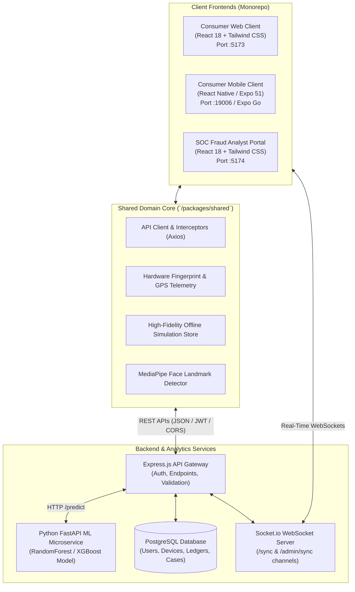
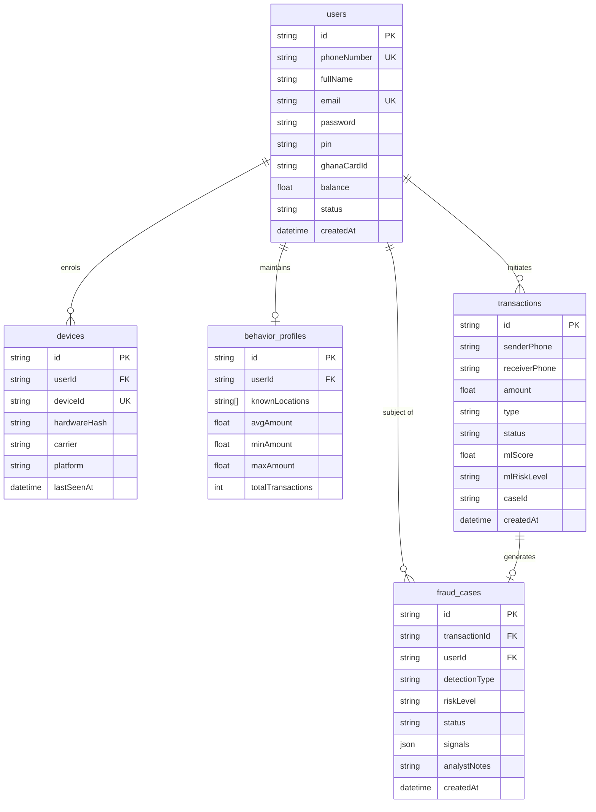
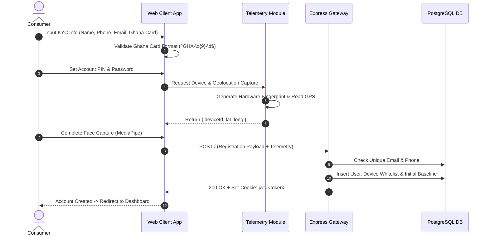
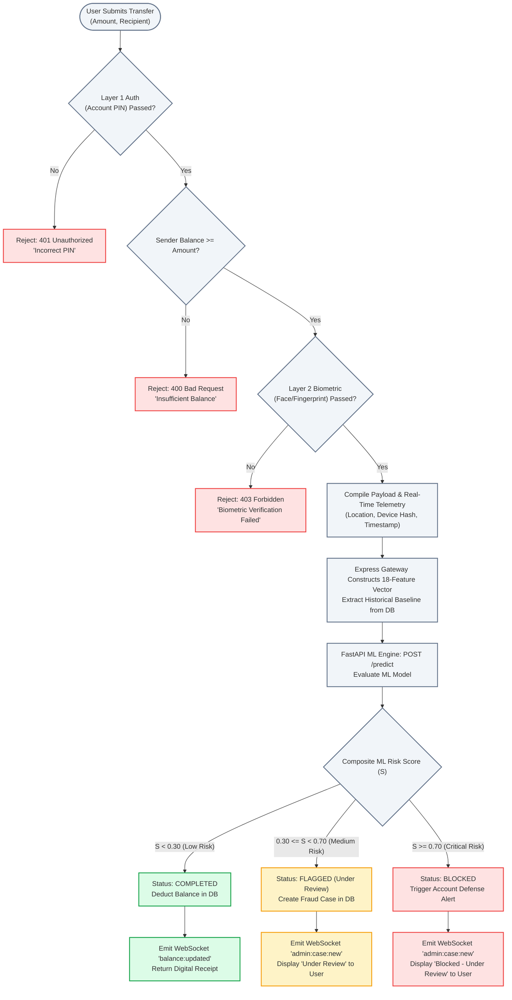
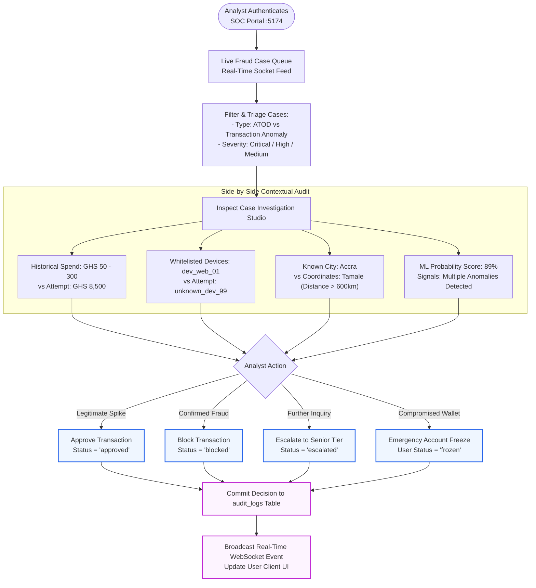

# AI-Based Detection of Suspicious Mobile Money Transactions Caused by Account Compromise and Abnormal Transaction Behaviour

[](#abstract--research-context)
[](#system-architecture)
[](#multi-surface-platform-overview)
[](#machine-learning-pipeline--inference-engine)
[](#research-scope--problem-formulation)

---

## Abstract & Research Context

Mobile Money (MoMo) has emerged as the dominant financial transaction rail across Sub-Saharan Africa, processing hundreds of billions of dollars annually. In Ghana, platforms such as MTN MoMo, Telecel Cash, and AT Money facilitate peer-to-peer transfers, merchant remittances, and bill payments for tens of millions of registered subscribers. However, this growth has been accompanied by a surge in cyber fraud—predominantly **Account Takeover (ATO)** and **behavioral credential compromise**.

Traditional fraud defense systems implemented by telecommunications operators rely on static, rule-based thresholds (e.g., daily velocity caps). These rule engines struggle to distinguish legitimate burst transactions from automated account draining, and cannot detect sophisticated compromises occurring from unfamiliar devices and geographical locations.

This repository represents the complete experimental prototype and engineering implementation for the research project:
> **"AI-Based Detection of Suspicious Mobile Money Transactions Caused by Account Compromise and Abnormal Transaction Behaviour"**

The system provides an end-to-end, multi-surface simulation platform comprising **three client frontends** (Consumer Web Client, Consumer Native Mobile App, and Security Operations Center [SOC] Fraud Analyst Admin Portal), backed by a real-time behavioral telemetry engine, layered multi-factor authentication (MFA), and a cloud-hosted Machine Learning inference pipeline.

---

## Table of Contents

1. [Research Scope & Problem Formulation](#research-scope--problem-formulation)
   - [Problem Statement](#problem-statement)
   - [In-Scope Detection Vectors](#in-scope-detection-vectors)
   - [Explicitly Out-of-Scope Domains](#explicitly-out-of-scope-domains)
   - [Implementation-Layer Security Mechanisms](#implementation-layer-security-mechanisms)
2. [Mathematical & Algorithmic Formulations](#mathematical--algorithmic-formulations)
   - [Spatial Displacement & Velocity Analysis](#1-spatial-displacement--velocity-analysis)
   - [Behavioral Anomaly Ratio](#2-behavioral-anomaly-ratio)
   - [Risk Probability Scoring & Decision Boundaries](#3-risk-probability-scoring--decision-boundaries)
3. [System Architecture](#system-architecture)
   - [Architectural Topology](#architectural-topology)
   - [Monorepo Structure](#monorepo-structure)
   - [Data Storage & Entity-Relationship Model](#data-storage--entity-relationship-model)
4. [Multi-Surface Platform Overview](#multi-surface-platform-overview)
   - [Consumer Web Portal (`apps/web`)](#1-consumer-web-portal-appsweb)
   - [Consumer Native Mobile Application (`apps/mobile`)](#2-consumer-native-mobile-application-appsmobile)
   - [SOC Fraud Analyst Admin Portal (`apps/admin`)](#3-soc-fraud-analyst-admin-portal-appsadmin)
   - [Shared Domain Logic (`packages/shared`)](#4-shared-domain-logic-packagesshared)
5. [End-to-End System Lifecycle ("How It Works")](#end-to-end-system-lifecycle-how-it-works)
   - [Phase 1: Registration, KYC & Device Enrolment](#phase-1-registration-kyc--device-enrolment)
   - [Phase 2: Authentication & Session Token Issuance](#phase-2-authentication--session-token-issuance)
   - [Phase 3: Transaction Initiation & Layered Step-Up](#phase-3-transaction-initiation--layered-step-up)
   - [Phase 4: Telemetry Aggregation & Feature Vector Construction](#phase-4-telemetry-aggregation--feature-vector-construction)
   - [Phase 5: Machine Learning Inference & Decisioning](#phase-5-machine-learning-inference--decisioning)
   - [Phase 6: Real-Time Synchronization & SOC Triage](#phase-6-real-time-synchronization--soc-triage)
6. [Complete System Flowcharts](#complete-system-flowcharts)
   - [1. User Onboarding & Hardware Fingerprinting Flow](#1-user-onboarding--hardware-fingerprinting-flow)
   - [2. Transaction Execution & Dual-Layer Decision Flow](#2-transaction-execution--dual-layer-decision-flow)
   - [3. SOC Fraud Analyst Investigation & Decisioning Flow](#3-soc-fraud-analyst-investigation--decisioning-flow)
7. [Machine Learning Pipeline & Inference Engine](#machine-learning-pipeline--inference-engine)
   - [Feature Vector Specification (18 Features)](#feature-vector-specification-18-features)
   - [Model Architecture & Inference Protocol](#model-architecture--inference-protocol)
8. [Technology Stack Matrix](#technology-stack-matrix)
9. [Experimental Evaluation & Demonstration Scenarios](#experimental-evaluation--demonstration-scenarios)
10. [Academic Defense Q&A Cheatsheet](#academic-defense-qa-cheatsheet)
11. [Installation & Local Deployment Guide](#installation--local-deployment-guide)
12. [Citation & Project Attribution](#citation--project-attribution)

---

## Research Scope & Problem Formulation

### Problem Statement

Mobile Money account compromise typically manifests in two distinct patterns:
1. **Account Takeover (ATO)**: Attackers acquire user credentials (via credential stuffing, phishing, or unauthorized device access) and access the wallet from an unrecognized device or geographical location to drain funds.
2. **Behavioral Anomalies**: Legitimate credentials are used, but the transaction attributes (transfer amount, velocity, or timing) deviate radically from the account holder's historical spending profile.

### In-Scope Detection Vectors

The system explicitly implements, measures, and tests two detection vectors:

| Detection Vector | Primary Indicators | Evaluation Logic |
|---|---|---|
| **Account Takeover Detection (ATOD)** | - New/Unrecognized Device Hardware Hash<br/>- Unfamiliar Geographical Coordinates<br/>- Simulated e-SIM Carrier/Profile Mismatch<br/>- Extreme Velocity After Dormancy | Compares real-time device identity and GPS/IP telemetry against the enrolled hardware whitelist and user baseline radius. |
| **Transaction Anomaly Detection** | - Extreme Outlier Transfer Amounts<br/>- Abnormal Expenditure Acceleration<br/>- Temporal Outlier (e.g., 03:00 AM transfer) | Measures current transaction parameters against statistical historical distributions ($\mu_{\text{historical}}$, $\sigma_{\text{historical}}$, min/max bounds). |

### Explicitly Out-of-Scope Domains

To maintain scientific rigor and work within the bounds of a simulated environment, several threat categories are **explicitly excluded**:

* **High-Risk Receiver Profiling**: Destination graph clustering and mule account network tracking are excluded in this research phase.
* **Physical SIM-Swap Fraud**: Real-world SIM swap detection requires internal telecommunication operator Signaling System 7 (SS7) or Home Location Register (HLR) signaling data. The prototype implements a **simulated e-SIM profile** client-side to model hardware trust without claiming MNO-level SS7 access.
* **Social Engineering / Vishing**: Psychological coercion (e.g., fraudulent phone calls, fake SMS lottery notifications) occurs outside technical client telemetry and is not modeled.
* **Money Laundering Syndicates**: Long-term structuring, layering, and AML graph traversal are out of scope.
* **Agent Kiosk Collusion**: Physical cash-in/cash-out merchant fraud is not modeled.

### Implementation-Layer Security Mechanisms

The application layer introduces risk-adaptive security controls to test how modern frontends interact with fraud engines:
* **Layer 1 Authentication**: User PIN / Password required for wallet authentication.
* **Layer 2 Biometric Step-Up**: Physical biometric sensor integration (Fingerprint on mobile via `expo-local-authentication`) and computer vision facial tracking (Web client via MediaPipe).
* **Escalation Protocol**: Automated step-up verification triggered dynamically when the backend fraud score exceeds baseline risk.
* **SOC Analyst Remediation**: Manual override authority (Approve, Block, Escalate, Freeze Account).

---

## Mathematical & Algorithmic Formulations

### 1. Spatial Displacement & Velocity Analysis

Geographic anomaly detection computes the great-circle distance between the user's last verified login coordinates $(\phi_1, \lambda_1)$ and the current transaction coordinates $(\phi_2, \lambda_2)$ using the **Haversine Formula**:

$$a = \sin^2\left(\frac{\Delta \phi}{2}\right) + \cos(\phi_1)\cos(\phi_2)\sin^2\left(\frac{\Delta \lambda}{2}\right)$$

$$c = 2 \cdot \operatorname{atan2}\left(\sqrt{a}, \sqrt{1-a}\right)$$

$$d = R \cdot c$$

Where:
* $\Delta \phi = \phi_2 - \phi_1$ (latitude difference in radians)
* $\Delta \lambda = \lambda_2 - \lambda_1$ (longitude difference in radians)
* $R = 6,371\text{ km}$ (Earth's mean radius)
* $d =$ Great-circle distance in kilometers.

The **Travel Velocity** $v$ is derived against the elapsed time $\Delta t = t_2 - t_1$:

$$v = \frac{d}{\Delta t}$$

If $v > 900\text{ km/h}$ (maximum commercial aviation speed), the system triggers an **Impossible Travel Anomaly** flag (`txn_unusual_location = 1`).

---

### 2. Behavioral Anomaly Ratio

For transactions initiated from familiar devices, financial deviation is quantified using the **Anomaly Ratio** ($AR$) relative to the user's historical expenditure mean:

$$AR = \frac{x_{\text{current}}}{\mu_{\text{historical}}}$$

Where:
* $x_{\text{current}}$ is the requested transaction amount in Ghana Cedis (GHS).
* $\mu_{\text{historical}} = \frac{1}{N} \sum_{i=1}^{N} x_i$ is the empirical mean of the user's last $N$ successful transactions.

The statistical **Z-Score** ($Z$) measures standard deviations from baseline:

$$Z = \frac{x_{\text{current}} - \mu_{\text{historical}}}{\sigma_{\text{historical}}}$$

Where $\sigma_{\text{historical}}$ is the standard deviation. A transaction is flagged as an anomaly if $AR > 3.0$ and $Z > 2.5$.

---

### 3. Risk Probability Scoring & Decision Boundaries

The machine learning classification engine maps the 18-element feature vector $\mathbf{x}$ to a composite fraud risk score $S \in [0.0, 1.0]$:

$$S = P(\text{Fraud} = 1 \mid \mathbf{x})$$

The system executes automated decisioning according to three risk tiers:

$$\text{Decision}(S) = \begin{cases} 
\textbf{Completed} \quad (\text{Instant Approval}) & \text{if } S < 0.30 \\
\textbf{Flagged} \quad (\text{Step-Up / SOC Review}) & \text{if } 0.30 \le S < 0.70 \\
\textbf{Blocked} \quad (\text{Immediate Rejection}) & \text{if } S \ge 0.70 
\end{cases}$$

---

## System Architecture

### Architectural Topology



---

### Monorepo Structure

```text
Simulated-Mobile-Money-App/
├── apps/
│   ├── web/                     # Consumer Web Application (React + Vite)
│   │   ├── src/
│   │   │   ├── components/      # BiometricModal, PinPad, TransactionFlow
│   │   │   ├── contexts/        # AuthContext (state & session management)
│   │   │   ├── pages/           # Dashboard, SendMoney, CashOut, Onboarding
│   │   │   └── store/           # Redux Toolkit store & telemetry slices
│   │   └── vite.config.js       # Dev server proxy configuration
│   ├── mobile/                  # Consumer Native Mobile Application (Expo)
│   │   ├── src/
│   │   │   └── components/      # Hardware Biometrics, Native PIN Pad, Cash Out
│   │   └── App.jsx              # Mobile root navigation & sync
│   └── admin/                   # SOC Fraud Analyst Portal (React + Vite)
│       └── src/
│           ├── pages/           # LiveFeed, CaseDetail, Analytics Studio
│           └── components/      # Side-by-side behavioral comparison cards
├── packages/
│   └── shared/                  # Shared Domain Package
│       └── src/
│           ├── api/             # client.js, endpoints.js, admin-endpoints.js, store.js
│           ├── components/      # Cross-platform SVG icon sets & badges
│           ├── constants/       # Risk thresholds, currency, routing constants
│           └── utils/           # biometrics.js, face-detector.js, device.js, location.js
├── assets/                      # Architectural diagrams & design assets
├── flowchart.md                 # System flowcharts & sequence diagrams
├── package.json                 # Monorepo workspace configuration
├── pnpm-workspace.yaml          # PNPM multi-package configuration
└── README.md                    # Research paper documentation (this file)
```

---

### Data Storage & Entity-Relationship Model



---

## Multi-Surface Platform Overview

### 1. Consumer Web Portal (`apps/web`)
* **Target User**: End-user accessing mobile money services via desktop or mobile web browser.
* **Core Capabilities**:
  * Multi-step onboarding with strict Ghana Card regex validation (`GHA-XXXXXXXXX-X`).
  * In-browser facial landmark verification powered by MediaPipe and HTML5 Canvas.
  * Comprehensive wallet operations: Peer-to-peer Send Money, Cash Out (Agent Token), Cash In (Deposit), Merchant Payments, and Bill Pay.
  * Geolocation telemetry using `navigator.geolocation` with fallback to IP-based coordinates.

### 2. Consumer Native Mobile Application (`apps/mobile`)
* **Target User**: Mobile subscriber on iOS or Android smartphone.
* **Core Capabilities**:
  * Hardware biometric sensor authentication (Fingerprint / FaceID) using `expo-local-authentication`.
  * Simulated e-SIM device profile generation (hardware fingerprint, carrier string, device model).
  * Socket.io background listener maintaining instantaneous balance and transaction synchronization with the web client.

### 3. SOC Fraud Analyst Admin Portal (`apps/admin`)
* **Target User**: Fraud Analyst, SOC Operator, or Compliance Officer.
* **Core Capabilities**:
  * Real-time triage feed receiving `admin:case:new` WebSocket events.
  * Strict classification tags distinguishing **Account Takeover Detection (ATOD)** from **Transaction Anomaly**.
  * Side-by-side behavioral comparative viewer: historical user baselines vs. current attempted transaction.
  * Audited remediation controls: Approve, Block, Escalate, and Freeze User Account.

### 4. Shared Domain Logic (`packages/shared`)
* **Core Capabilities**:
  * Single source of truth for API communication, telemetry computation, and state management.
  * Built-in dual-mode capability: Seamlessly switches between Cloud Express + FastAPI services and an offline, zero-dependency `SimStore` simulation engine.

---

## End-to-End System Lifecycle ("How It Works")

### Phase 1: Registration, KYC & Device Enrolment
1. The user provides their Full Name, Phone Number, Email, Date of Birth, and Ghana Card ID.
2. The client validates the Ghana Card against the national format specification: `^GHA-\d{9}-\d$`.
3. The device telemetry module generates a hardware profile (`deviceId`, `userAgent`, screen resolution, platform).
4. The client requests GPS location access; upon consent, exact latitude and longitude are recorded.
5. In web onboarding, the user completes an initial facial biometric scan to establish an enrolled template.
6. The user sets their Layer 1 secret (PIN/Password).
7. Upon successful registration, the backend establishes the user's initial baseline profile ($\mu_{\text{historical}}$, registered device whitelist, primary city).

### Phase 2: Authentication & Session Token Issuance
1. The user submits their phone number/email and PIN.
2. The server verifies the credentials against the database hash (Bcrypt).
3. The server issues a secure, session-scoped HTTP-only JWT cookie (`jwt=...; SameSite=Lax; HttpOnly; Secure`).
4. The frontend connects to the Socket.io server and subscribes to the user-specific channel `sync:<userId>`.

### Phase 3: Transaction Initiation & Layered Step-Up
1. The user inputs transaction details: Amount (GHS) and Recipient Phone Number.
2. The interface prompts for **Layer 1 Authorization** (PIN/Password entry).
3. The interface immediately prompts for **Layer 2 Biometric Authorization**:
   - **On Mobile**: Prompts device sensor (Fingerprint / FaceID).
   - **On Web**: Opens camera overlay; MediaPipe analyzes eye alignment, facial symmetry, and live presence.
4. If Layer 2 fails twice, the transaction is locked client-side.

### Phase 4: Telemetry Aggregation & Feature Vector Construction
1. The client captures fresh GPS coordinates and current timestamp.
2. The client packages the transaction payload:
   ```json
   {
     "amount": 500.0,
     "SenderPhone": "233-547793444",
     "receiverPhone": "233-248490032",
     "device": "dev_1788266936414_c31h9nvv",
     "location": { "lat": 5.6037, "long": -0.187 }
   }
   ```
3. The Express API Gateway intercepts the request, validates the JWT session, retrieves the user's historical profile, and builds the 18-element inference vector.

### Phase 5: Machine Learning Inference & Decisioning
1. The Express Gateway transmits the feature vector to the FastAPI Machine Learning microservice (`POST /predict`).
2. The model generates a risk probability score $S \in [0.0, 1.0]$.
3. **Execution Decision**:
   - $S < 0.30$: Transaction executed immediately; balance debited; receipt returned.
   - $0.30 \le S < 0.70$: Transaction held as `Flagged (Under Review)`; a fraud case is created and pushed to the SOC Admin Portal.
   - $S \ge 0.70$: Transaction rejected as `Blocked`; account protection alert dispatched.

### Phase 6: Real-Time Synchronization & SOC Triage
1. State changes are broadcast via Socket.io:
   - User channel receives `balance:updated` and `transaction:updated`.
   - Admin channel receives `admin:case:new`.
2. The SOC analyst reviews the flagged case on the Admin Portal, examines the behavioral deviation, and clicks **Approve** or **Block**.
3. The analyst's decision triggers a WebSocket broadcast, updating the user's client UI in real time.

---

## Complete System Flowcharts

### 1. User Onboarding & Hardware Fingerprinting Flow



---

### 2. Transaction Execution & Dual-Layer Decision Flow



---

### 3. SOC Fraud Analyst Investigation & Decisioning Flow



---

## Machine Learning Pipeline & Inference Engine

### Feature Vector Specification (18 Features)

The prediction microservice receives a structured 18-element feature vector synthesized from client telemetry and historical database baselines:

| Feature Name | Data Type | Value Domain | Description |
|---|---|---|---|
| `is_new_user` | Integer | $\{0, 1\}$ | Binary indicator: account age $< 7$ days. |
| `txn_unusual_location` | Integer | $\{0, 1\}$ | Binary flag: Haversine distance $> 50\text{ km}$ from known centroid. |
| `txn_unusual_time` | Integer | $\{0, 1\}$ | Binary flag: transaction initiated outside user's typical hours. |
| `txn_unusual_amount` | Integer | $\{0, 1\}$ | Binary flag: $AR = x_{\text{current}} / \mu_{\text{historical}} > 3.0$. |
| `device_changed` | Integer | $\{0, 1\}$ | Binary flag: incoming `deviceId` not in user's device whitelist. |
| `ip_mismatch` | Integer | $\{0, 1\}$ | Binary flag: client IP subnet differs from historical ISPs. |
| `has_multiple_anomalies` | Integer | $\{0, 1\}$ | Binary flag: $\sum \text{anomalies} \ge 2$. |
| `sim_device_change` | Integer | $\{0, 1\}$ | Binary flag: simulated e-SIM carrier/hardware mismatch. |
| `account_takeover_risk` | Float | $[0.0, 1.0]$ | Heuristic ATOD sub-score derived from hardware telemetry. |
| `fraud_detected` | Integer | $\{0, 1\}$ | Preliminary threshold trigger flag. |
| `was_reversed` | Integer | $\{0, 1\}$ | Historical indicator: user has past chargebacks/reversals. |
| `was_reported` | Integer | $\{0, 1\}$ | Historical indicator: user was previously flagged in fraud reports. |
| `fraud_account_takeover` | Integer | $\{0, 1\}$ | Target label classification for ATOD vector. |
| `platform_mtn_momo` | Integer | $\{0, 1\}$ | Transaction routing network identifier. |
| `txn_cash_in` | Integer | $\{0, 1\}$ | One-hot encoded transaction category: Cash In. |
| `txn_cash_out` | Integer | $\{0, 1\}$ | One-hot encoded transaction category: Cash Out. |
| `victim_vulnerability` | Float | $[0.0, 1.0]$ | Derived metric based on user age, low activity, and balance ratio. |
| `detection_score` | Float | $[0.0, 1.0]$ | Prior model score or ensemble baseline confidence. |

### Model Architecture & Inference Protocol

* **Model Family**: Ensemble Decision Trees (Random Forest Classifier / XGBoost).
* **Objective Function**: Binary cross-entropy optimized for high recall on the positive (fraud) class.
* **Inference Endpoint**: `POST https://machine-learning-server-3.onrender.com/transaction`
* **Response Payload**:
  ```json
  {
    "status": "success",
    "fraud_risk_score": 0.89,
    "risk_level": "critical",
    "signals": ["unregistered_device", "extreme_amount", "unfamiliar_location"],
    "action": "block"
  }
  ```

---

## Technology Stack Matrix

| Architecture Layer | Component | Technologies Used | Justification |
|---|---|---|---|
| **Web Frontend** | Consumer Web App | React 18, Vite, Tailwind CSS, Redux Toolkit | High-performance SPA with rapid Hot Module Replacement and modular state slices. |
| **Mobile Frontend** | Consumer Mobile App | React Native, Expo 51, Expo Local Authentication | Native mobile compilation with access to physical fingerprint and biometric hardware sensors. |
| **Admin SOC Portal** | Fraud Analyst Studio | React 18, Vite, Tailwind CSS, Recharts | Dedicated analyst workspace with real-time charting, triage queues, and case drill-downs. |
| **Shared Core** | Cross-Platform Library | ES Modules, Axios, MediaPipe Vision | Single codebase sharing types, API interceptors, and computer vision face tracking. |
| **API Gateway** | REST Services | Node.js, Express.js, Joi Validator | Non-blocking I/O gateway managing authentication, input sanitization, and database orchestration. |
| **ML Microservice** | Prediction Engine | Python 3.10+, FastAPI, Scikit-Learn | Fast, lightweight asynchronous inference server delivering sub-100ms model predictions. |
| **Real-Time Sync** | WebSocket Channels | Socket.io Client & Server | Bidirectional event streaming for instant multi-client balance and live fraud feed synchronization. |
| **Data Persistence** | Relational Database | PostgreSQL / LocalStorage SimStore | ACID-compliant relational storage in cloud production, with seamless offline local fallback. |

---

## Experimental Evaluation & Demonstration Scenarios

For the research defense and experimental evaluation, the platform supports three repeatable test scenarios:

### Scenario A: Normal Routine Transaction (Baseline Verification)
* **Pre-conditions**: Enrolled user on primary device (`dev_web_01`) located in Accra.
* **Execution**: User initiates a peer-to-peer transfer of `GHS 80.00` (within historical range of GHS 50–200).
* **Security Checks**: Layer 1 PIN validated; Layer 2 Biometrics confirmed.
* **Telemetry Output**: `device_changed = 0`, `txn_unusual_location = 0`, `txn_unusual_amount = 0`.
* **Experimental Outcome**: ML score evaluates at $S = 0.08$ ($< 0.30$). Transaction is marked `Completed` instantly. Balance updates across all surfaces in $< 1\text{ second}$.

### Scenario B: Account Takeover Attack (ATOD Vector Verification)
* **Pre-conditions**: Attacker obtains victim's phone number and PIN. Attacker attempts login from an unauthorized laptop in Tamale ($> 600\text{ km}$ distance) using an incognito session.
* **Execution**: Attacker attempts to transfer `GHS 1,500.00`.
* **Telemetry Output**: `device_changed = 1`, `txn_unusual_location = 1`, `has_multiple_anomalies = 1`, `account_takeover_risk = 0.88`.
* **Experimental Outcome**: ML score evaluates at $S = 0.91$ ($\ge 0.70$). Transaction status transitions to `Blocked (Account Protection Triggered)`. Incident case is generated immediately and pushed to the SOC Admin Portal with high priority.

### Scenario C: Transaction Anomaly (Outlier Expenditure Verification)
* **Pre-conditions**: Legitimate user on their verified mobile phone.
* **Execution**: User attempts an unusually large transfer of `GHS 9,000.00` (historical average is GHS 120.00; $AR = 75.0$).
* **Telemetry Output**: `device_changed = 0`, `txn_unusual_location = 0`, `txn_unusual_amount = 1`, `detection_score = 0.62`.
* **Experimental Outcome**: ML score evaluates at $S = 0.58$ ($0.30 \le S < 0.70$). Transaction is designated as `Flagged (Under Review)`. The SOC analyst views a side-by-side behavioral comparison on `http://localhost:5174` and manually audits the case.

---

## Academic Defense Q&A Cheatsheet

| Anticipated Examiner Question | Grounded Technical Answer |
|---|---|
| **"Why is physical SIM-swap fraud excluded from this study?"** | Detecting physical SIM swaps requires access to telecommunication SS7/HLR signaling registers (IMSI update timestamps), which are proprietary to MNOs and inaccessible to third-party applications. To model hardware trust within application boundaries, we implemented client-side **e-SIM device fingerprinting**, evaluating hardware identity shifts without making unprovable claims regarding core telecom infrastructure. |
| **"How does the system mitigate false positives on legitimate burst purchases?"** | The system avoids hard-blocking ambiguous transactions. Mid-tier risk scores ($0.30 \le S < 0.70$) place the transaction in an `Under Review` status and trigger mandatory **Layer 2 Biometric Step-Up** rather than rejecting it outright. If the legitimate user passes biometric verification, the transaction proceeds. |
| **"What happens if a user disables GPS location permissions?"** | If the physical GPS sensor is declined or times out, the telemetry engine falls back to network-level IP geolocation (as implemented in `location.js`). If location data is completely unavailable, the anomaly vector assigns an indeterminate flag, shifting greater weighting to device identity and transaction amount metrics. |
| **"How are cold-start accounts evaluated before a history exists?"** | New accounts ($\text{age} < 7\text{ days}$) are tagged with `is_new_user = 1`. During the initial calibration period, the anomaly engine applies population-wide cohort thresholds rather than personalized historical means, gradually transitioning to personalized Z-scores as transaction count exceeds $N \ge 5$. |

---

## Installation & Local Deployment Guide

### Prerequisites
* **Node.js**: Version `18.x` or `20.x` LTS
* **PNPM**: Fast package manager (`npm install -g pnpm`)
* **Git**: Version control client

### 1. Clone & Install Dependencies
```bash
# Clone the repository
git clone https://github.com/heyywillz/Simulated-Mobile-Money-App-Frontend.git
cd Simulated-Mobile-Money-App-Frontend

# Install all monorepo dependencies
pnpm install
```

### 2. Launch Client Surfaces Locally

* **Consumer Web Application** (Port `5173`):
  ```bash
  pnpm dev:web
  ```
  Accessible in browser: `http://localhost:5173`

* **SOC Fraud Analyst Portal** (Port `5174`):
  ```bash
  pnpm dev:admin
  ```
  Accessible in browser: `http://localhost:5174`

* **Consumer Mobile Application** (Expo Native):
  ```bash
  pnpm dev:mobile
  ```
  Scan the terminal QR code with Expo Go on a mobile device, or press `w` to run in web emulation mode.

---

## Citation & Project Attribution

If citing this software architecture, telemetry methodology, or experimental prototype in academic research papers, dissertations, or conference proceedings, please use the following citation format:

```bibtex
@misc{momo_fraud_detection_2026,
  title={AI-Based Detection of Suspicious Mobile Money Transactions Caused by Account Compromise and Abnormal Transaction Behaviour},
  author={Atabisa, Williams and Project Research Group},
  year={2026},
  howpublished={\url{https://github.com/heyywillz/Simulated-Mobile-Money-App-Frontend}},
  note={Final-Year Research Project Implementation, Group Prototype}
}
```

---
*Designed, engineered, and documented for empirical research validation and defense in Mobile Money Fraud Detection Systems.*
