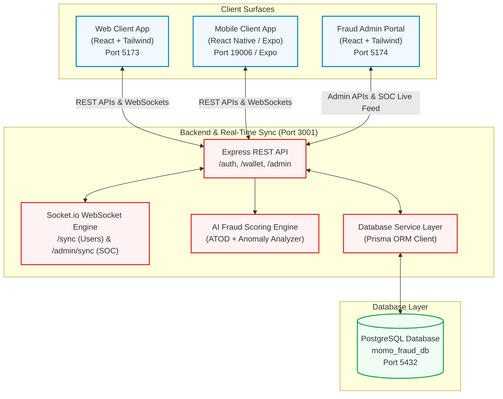
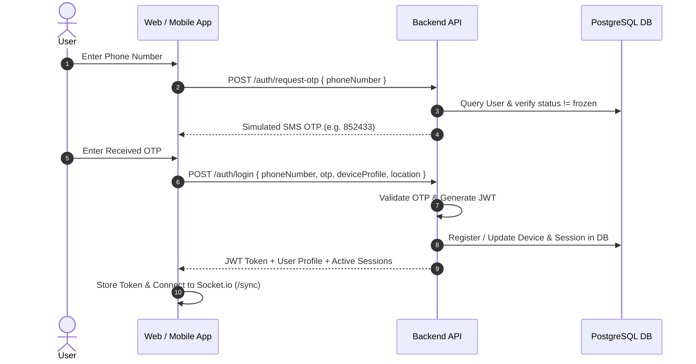
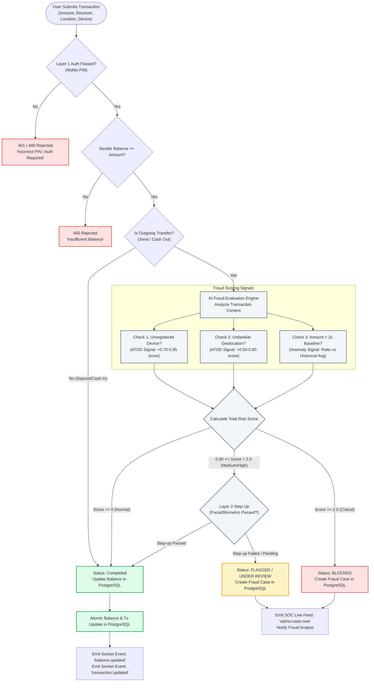
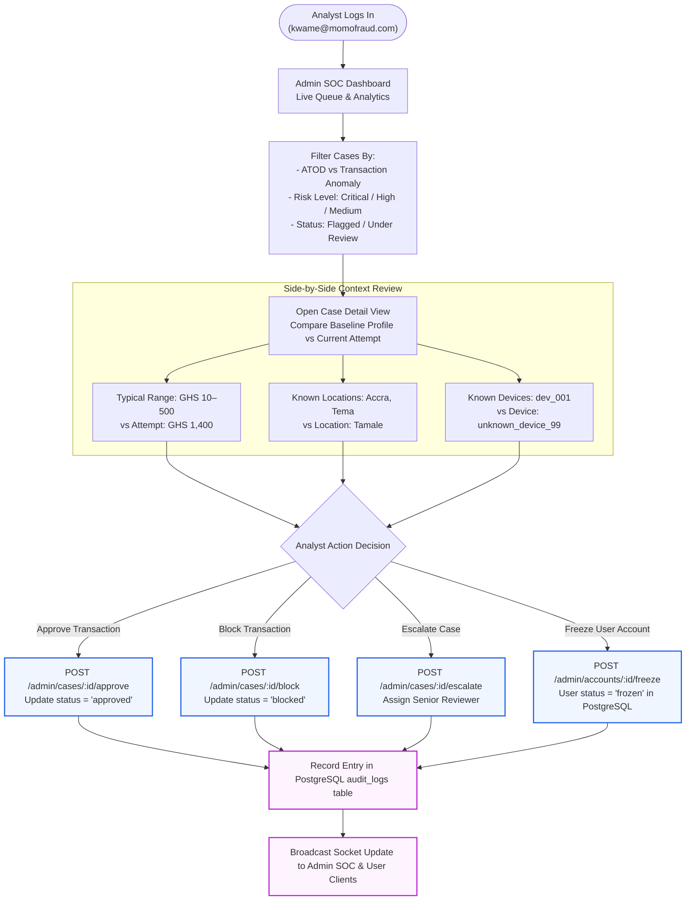
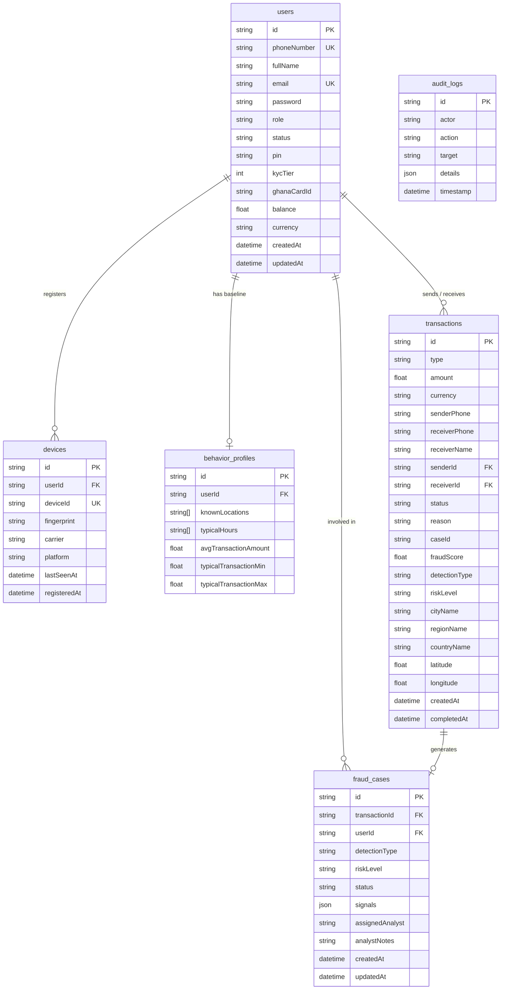

# Simulated Mobile Money Platform — System Flowcharts

This document provides visual flowcharts and architectural diagrams for the **AI-Based Mobile Money Fraud Detection System** (demonstrating **Account Takeover Detection [ATOD]** and **Transaction Anomaly Detection**).

---

## 1. High-Level System Architecture

---

## 2. User Onboarding, Device Registration & Layered Login Flow

---

## 3. Transaction Execution & AI Fraud Detection Decision Flow

---

## 4. Fraud Analyst Admin Portal (SOC) Workflow

---

## 5. PostgreSQL Database Entity Relationship Diagram (ERD)

